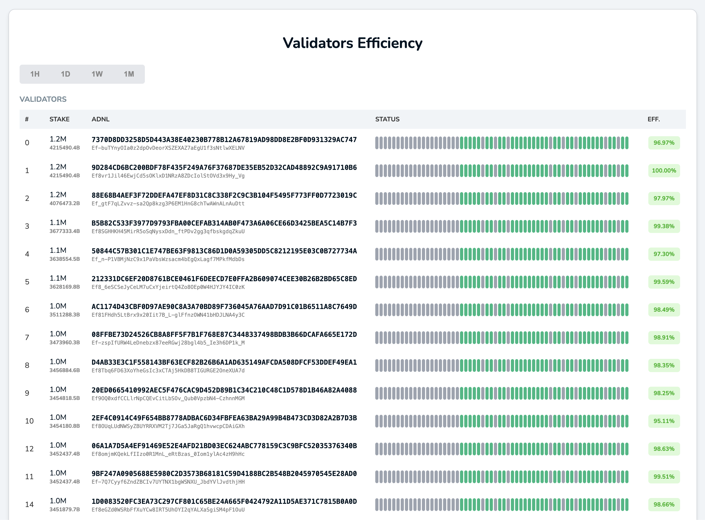
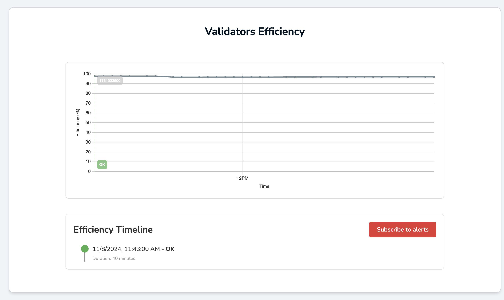

# TON Validator Monitoring Platform

The Validator Monitoring Platform is designed to simplify and optimize validator operations. It provides real-time monitoring of validator efficiency and offers automated notifications for abnormal behavior, helping teams maintain and expand the validator pool while reducing operational overhead.

## Key Features
- **Cycle and Scoreboard Monitoring**: Continuously tracks voting cycles and evaluates validator efficiency.
- **Real-Time Notifications**: Automatically sends alerts through Telegram when validator performance drops below a configurable threshold.
- **Historical Data Aggregation**: Aggregates data over extended periods, supporting hourly and daily queries for long-term analysis.
- **Data Visualization**: Displays validator efficiency metrics through dynamic charts powered by Redis caching and Chart.js.
- **ClickHouse Integration**: Stores cycle and scoreboard data in ClickHouse, with partitioned tables for optimized storage and querying.
- **Customizable Environment**: All hosts and parameters are configurable via environment variables.

Validators health:

Efficiency chart:

## Architecture Overview

1. **Scrapper Module**: Retrieves voting cycles and scoreboard data from external APIs and saves it to ClickHouse.
2. **Checker Module**: Monitors validator efficiency against a defined threshold and tracks state changes.
3. **Notifier Module**: Manages notifications and subscriptions via the Telegram API

## Installation and Setup

1. **Prerequisites**:
    - Docker
    - Redis 
    - ClickHouse

2. **Environment Variables**: Configure the environment variables for hosts, ports, and thresholds in a `.env` file.

3. **Deployment**:
    - Build and deploy the Go backend in Kubernetes.
    - Set up the Ingress and load balancers for external access.
    - Deploy Redis and ClickHouse.

4. **Migrations**: The platform runs migrations automatically on startup to set up necessary tables in ClickHouse.

## Usage

### Monitoring Validator Efficiency

1. **Threshold-based Alerts**: The Checker module monitors validator performance and sends alerts if efficiency falls below a defined threshold.
2. **State Change Tracking**: Only sends notifications on state changes (e.g., `ok` to `not ok`), reducing notification noise.
3. **Historical Data**: Provides aggregated metrics for long-term trend analysis.

## Contributing

Contributions are welcome! Please open issues or pull requests for new features, improvements, or bug fixes.

---

For any questions or support, please contact the development team.

